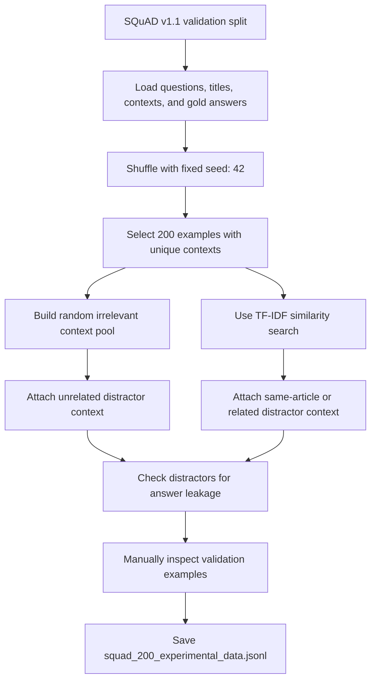

# Poster Presentation: When does RAG hurt?  An Experimental Study  of Different Contexts in Question Answering

This repository contains the code, data, results, and figures for a poster presentation experiment studying how different context conditions affect large language model performance on short-answer question answering.

The experiment uses a 200-question sample derived from SQuAD v1.1 and evaluates each question under four prompt conditions, producing 800 requests per model. The final comparison includes Qwen, GPT, and DeepSeek.

## Research Question

How does the presence, absence, or type of context influence an LLM's ability to answer factual questions accurately?

The project compares:

- `no_context`: the model receives only the question.
- `relevant_context`: the model receives the correct supporting passage.
- `random_irrelevant`: the model receives an unrelated passage from a different topic.
- `same_article_irrelevant`: the model receives a passage from the same article or related topic that does not contain the answer.

## Repository Structure

```text
.
├── Appendix.docx
├── Code/
│   ├── Data_Preparation.ipynb
│   └── Experiment.ipynb
├── Datasets/
│   ├── squad_200_experimental_data.jsonl
│   ├── Copy of squad_200_experimental_data.jsonl
│   └── qwen_pilot_80_results.jsonl
├── Outputs/
│   ├── deepseek_full_800_results.jsonl
│   ├── gpt_full_800_results.jsonl
│   └── qwen_full_800_results.jsonl
└── Screen Shorts Diagram/
    ├── compact_results_table.png
    ├── f1_change_final_compact.png
    ├── f1_changes_graphical.png
    └── hurt_help_compact.png
```

## Files

### Code

- `Code/Data_Preparation.ipynb`: Builds the 200-question experimental sample from SQuAD, creates random irrelevant and related irrelevant distractor contexts, checks for answer leakage, and saves the final JSONL dataset.
- `Code/Experiment.ipynb`: Builds the 800 prompt requests, runs pilot and full experiments, calls the evaluated models, computes Exact Match and F1, and generates final analysis tables and figures.

### Data

- `Datasets/squad_200_experimental_data.jsonl`: Main experimental dataset with 200 questions and their context variants.
- `Datasets/Copy of squad_200_experimental_data.jsonl`: Backup copy of the main experimental dataset.
- `Datasets/qwen_pilot_80_results.jsonl`: Pilot run over 20 questions and four conditions.

### Outputs

Each full output file contains 800 JSONL rows: 200 questions multiplied by four prompt conditions.

- `Outputs/qwen_full_800_results.jsonl`
- `Outputs/gpt_full_800_results.jsonl`
- `Outputs/deepseek_full_800_results.jsonl`

### Figures

The `Screen Shorts Diagram/` folder contains compact poster-ready result graphics, including the final results table, F1 change visualization, and hurt/help analysis.

## Methodology

1. Load the SQuAD v1.1 validation split.
2. Select a reproducible 200-question sample using a fixed seed.
3. For each question, create four experimental conditions:
   - no context
   - relevant context
   - random irrelevant context
   - same-article or related irrelevant context
4. Run the same 800 requests for each model.
5. Evaluate answers with SQuAD-style Exact Match and token-level F1.
6. Compare average performance by model and condition.
7. Analyze whether irrelevant context helps, hurts, or leaves answers unchanged compared with the no-context baseline.

## Dataset Construction from SQuAD

The 200-question experimental dataset was created in `Code/Data_Preparation.ipynb` from the SQuAD v1.1 validation set. The notebook does not simply take the first 200 rows. It uses a fixed random seed and filters the sample so the selected questions come from unique contexts, which makes the final set more diverse and reproducible.



### Sampling Summary

| Step | What Was Done | Purpose |
|---|---|---|
| Load SQuAD | Loaded the SQuAD v1.1 validation split using Hugging Face `datasets`. | Provides factual questions, supporting passages, titles, and gold answers. |
| Fixed seed | Used seed `42` during sampling. | Makes the same 200-question sample reproducible. |
| Unique contexts | Selected questions while avoiding repeated source contexts. | Prevents the sample from being dominated by duplicate or near-duplicate passages. |
| Random distractors | Chose irrelevant passages from other examples, preferably different titles, without the gold answer. | Tests whether unrelated context hurts model answers. |
| Related distractors | Used TF-IDF cosine similarity to find passages that look topically related but do not contain the answer. | Tests a harder irrelevant-context condition. |
| Leakage check | Checked whether distractor contexts accidentally included gold answers. | Keeps the irrelevant-context conditions fair. |
| Manual validation | Inspected a subset of examples before model calls. | Confirms that distractors are reasonable for the experiment. |

Each final row contains the question ID, article title, question, gold answers, relevant context, random irrelevant context, related irrelevant context, and metadata about the related distractor. During the experiment, each of these 200 rows is expanded into four prompt conditions, producing 800 model requests per model.

## Main Results

Average F1 scores from the final full experiment:

| Model | No Context | Relevant Context | Random Irrelevant | Same-Article Irrelevant |
|---|---:|---:|---:|---:|
| Qwen | 21.42 | 84.57 | 5.58 | 12.41 |
| GPT | 30.84 | 82.53 | 25.98 | 36.10 |
| DeepSeek | 30.91 | 90.37 | 14.09 | 24.22 |

Average Exact Match scores:

| Model | No Context | Relevant Context | Random Irrelevant | Same-Article Irrelevant |
|---|---:|---:|---:|---:|
| Qwen | 10.50 | 68.00 | 1.00 | 4.00 |
| GPT | 17.50 | 63.00 | 14.50 | 17.50 |
| DeepSeek | 18.50 | 81.50 | 10.00 | 15.00 |

Key observations:

- Relevant context strongly improves performance for all three models.
- Random irrelevant context usually hurts performance compared with no context.
- Same-article irrelevant context is more subtle: it can look topically useful while still failing to contain the answer.
- DeepSeek achieved the highest F1 under relevant context in this experiment.
- Qwen was the most sensitive to irrelevant context, showing the largest performance drop under distractor conditions.

## Reproducing the Experiment

The notebooks were developed in Google Colab. To reproduce the workflow:

1. Open `Code/Data_Preparation.ipynb`.
2. Install required packages if needed:

   ```bash
   pip install datasets scikit-learn numpy pandas matplotlib transformers torch openai
   ```

3. Run the data preparation notebook to regenerate `squad_200_experimental_data.jsonl`.
4. Open `Code/Experiment.ipynb`.
5. Update file paths if running outside Google Drive or Colab.
6. Provide API keys interactively when prompted for OpenAI or OpenRouter.
7. Run the model calls and evaluation cells.

## API Key Safety

API keys are not required to inspect the saved outputs or figures. They are only needed to rerun hosted model calls.

Do not commit API keys, `.env` files, Colab output containing credentials, or local credential files. The experiment notebook prompts for keys interactively.

## Notes

- The dataset sample uses fixed random seeds for reproducibility.
- The final results are already saved in `Outputs/`, so the analysis can be reviewed without rerunning model APIs.
- Generated figures are included for poster presentation use.

## License

No license has been added yet. Add a license before reusing or distributing this work beyond the intended presentation context.
